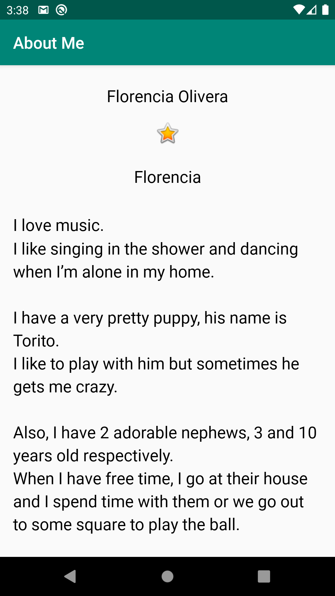

# AboutMe
## Learning about:
* Learn different kinds of views and resources
* Explore arranging elements with the Android Studio's Layout Editor
* Connect views with data through data binding
## Screenshots:

